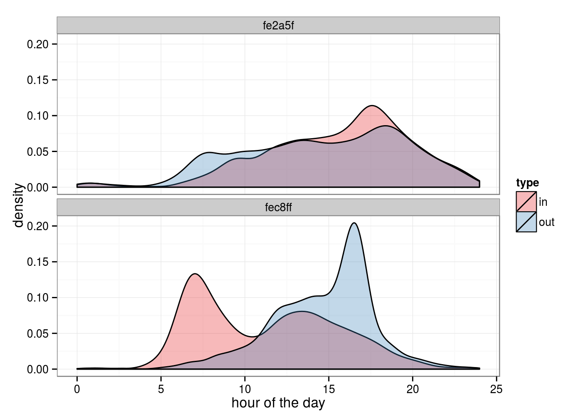
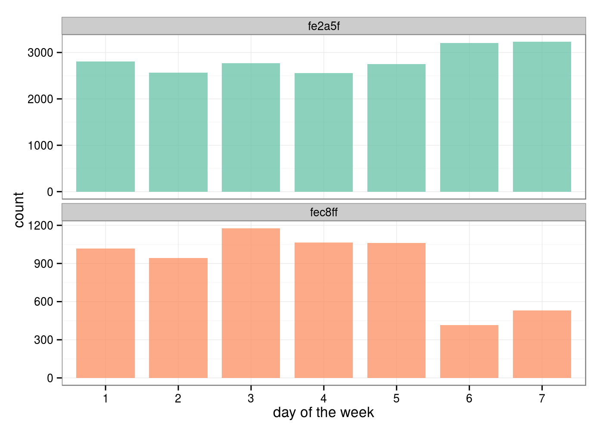
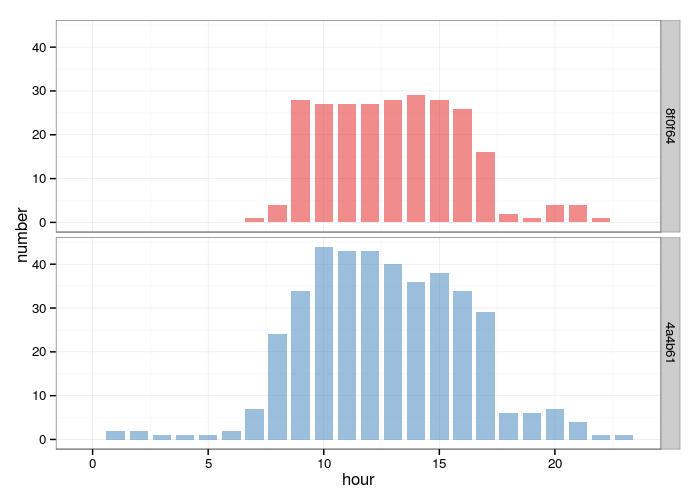

# Bike Sharing Data
Giovanni Fossati  


## PREAMBLE

The source files are posted at [https://github.com/pedrosan/DaInCh](https://github.com/pedrosan/DaInCh)

## PRELIMINARIES

Libraries needed for data processing and plotting:


```r
library("lubridate")
library("plyr")
library("ggplot2")
library("gridExtra")
```

## LOADING AND PREPROCESSING THE DATA

The dataset is read-in into a data frame `data` and a few basic operations
are perfomed: 

* columns are renamed and re-ordered (to put the _leave station_ before the _arrive station_).
* time-related columns are converted from character to time class using functions from the `lubridate` package.
* a trip-duration `dt` variable is added.
* the data frame is sorted by `bike` and `time`.
* row names are removed.


```r
Classes <- c("character", "character", "character", "character", "character")
data <- read.csv("data/bike_sharing_data.csv.gz", colClasses = Classes, nrows = 1804000, strip.white = TRUE)
colnames(data) <- c("bike", "station2", "station1", "time1", "time2")

# re-ordering columns
data <- data[, c(1,3,2,4,5)]

# converting strings into times
data$time1 <- ymd_hms(data$time1, tz = "US/Eastern")
data$time2 <- ymd_hms(data$time2, tz = "US/Eastern")

# adding trip duration in seconds
data$dt <- difftime(data$time2, data$time1, units = "secs")

# Sorting the data frame by bike and time1
i.sort <- order(data$bike, data$time1)
data <- data[i.sort, ]

row.names(data) <- NULL
```

The resulting data frame has the following structure:

```r
str(data)
# 'data.frame':	1802997 obs. of  6 variables:
#  $ bike    : chr  "000a8008" "000a8008" "000a8008" "000a8008" ...
#  $ station1: chr  "2f4a41" "68c784" "fa4911" "47dfc2" ...
#  $ station2: chr  "68c784" "fa4911" "47dfc2" "57e7d6" ...
#  $ time1   : POSIXct, format: "2013-10-02 06:46:13" "2013-10-02 07:13:58" "2013-10-02 07:35:56" ...
#  $ time2   : POSIXct, format: "2013-10-02 06:53:54" "2013-10-02 07:19:07" "2013-10-02 07:54:03" ...
#  $ dt      :Class 'difftime'  atomic [1:1802997] 461 309 1087 1062 245 ...
#   .. ..- attr(*, "units")= chr "secs"
```

### Checks on `NA` and stats on some variables


```r
# checking for NA
sum(is.na(data))
# [1] 0

# checking number of "levels" 
length(unique(data$bike))    
# [1] 6549
length(unique(data$station1))
# [1] 330
length(unique(data$station2))
# [1] 329

# create arrays of unique values for bike, station1, station2 IDs
bikes <- unique(data$bike)
stations1 <- unique(data$station1)
stations2 <- unique(data$station2)

# check cross-matching of station lists
sum(! (stations1 %in% stations2) )  # 1 false ?
# [1] 1
sum(! (stations2 %in% stations1) )  # all true
# [1] 0
```
 
<hr class="thin_separator">
<a name="question_A"></a>

## [A] Average trip duration (in seconds)

Average trip duration computed straight from the `dt` variable.


```r
summary(as.numeric(data$dt))
#    Min. 1st Qu.  Median    Mean 3rd Qu.    Max. 
#    60.0   412.0   664.0   886.6  1099.0 24830.0
```

The range of trip durations is quite wide, with __mean =886.6__, 
but the __median = 664__ may be a better metric.


<hr class="thin_separator">
<a name="question_B"></a>

## [B] Estimate the minimum fraction of the original dataset that must be missing

One way of addressing this question is to analyze the trips of each individual bike looking
for mis-matches between arrival / departure stations.

This approach assumes that bikes' trips are _continuous_, which may be a
strong assumption considering the possibility that bikes are actually being "manually" relocated 
for instance to keep their distribution optimal.

Nevertheless, here we look at individual bike trips searching for non-matching consecutive stations.


```r
# finding mis-matching stations over the full data set
bike.stats <- ddply(data, .(bike), summarize, 
                    Ntrips = length(time1),
                    mismatches = sum(station1[-1] != station2[1:(length(time1)-1)]), 
                    fraction = mismatches/Ntrips)

N.mismatches <- sum(bike.stats$mismatches) 

# Minimum-Original-Total = Existing data + Number of mismatches
min.missing.fraction <- N.mismatches / ( nrow(data) + N.mismatches )
```

* We find that the number of non-matching consecutive (arrival/departure) stations is 215592.

* Based on this approach the __minimum fraction of data that must be missing__ from original data set is
$N_{mismatches} / (N_{data} + N_{mismatches})$, that is __0.107__.


<hr class="thin_separator">
<a name="question_C"></a>

## [C] Based on the available data, what is the average amount of time a bike spends at a station in seconds?

Why are there negative "parking" duration for otherwise fine-looking trips?!?!?!

We need to select the entries where a bike arrived and left for the next trip from the same station.
Since the data frame is already ordered by bike ID and time (`time1`), we can compare the values
of `station1` and `station2` offset by one row at once on the full data frame.


```r
# on the full dataset
main <- data[-nrow(data), ]
main$tdiff <- difftime(data$time1[-1], data$time2[-nrow(data)])
main$flag.combined <-  (data$station1[-1] == data$station2[-nrow(data)]) & (data$bike[-1] == data$bike[-nrow(data)])
main$flag.station <- c(main$station1[-1] == main$station2[-nrow(main)], NA)
# main[main$flag.combined & as.numeric(main$tdiff) < 0, ]

good.tdiff <- main$tdiff[main$flag.combined & as.numeric(main$tdiff) > 0]
length(good.tdiff)
# [1] 1580813
```

There are 43 valid (same bike, same station) 
parking intervals with NEGATIVE DURATION (!?).   
We can safely ignore them for now considering that they are a tiny fraction of the accepted _stays_, i.e. 
1580813.

The statistics of the duration of _stays_ are therefore:


```r
ss <- summary(as.numeric(good.tdiff))
ss
#    Min. 1st Qu.  Median    Mean 3rd Qu.    Max. 
#       1     433    1721   10090    7115 4088000
```

As it was the case for trip durations, the range of _stays_ durations is quite wide, in fact even wider and it makes
sense considering that there is really no limit in principle to for how a bike may remain unused.

At any rate, the __mean time spent by a bike at a station is 10090__, 
while its __median__ is __1721__.


```r
# quick check of +/- 1 row around each of the odd ones
neg.rows <- (1:nrow(main))[main$flag.combined & as.numeric(main$tdiff) < 0]
rows2check <- sort(c(neg.rows, (neg.rows-1), (neg.rows+1)))
main[rows2check, ]
```


<hr class="thin_separator">
<a name="question_D"></a>

## [D] Describe and explain the major qualitative usage pattern for station 'fe2a5f' and how it differs from station 'fec8ff'

### Data preparation

Let's first extract the relevant data, adding columns with the _time-during-the-day_ and _day-of-the-week_ for
each entry involving the two stations under examination.   
We also add flags for whether a given activity was in/out, or during the week (M-F) or week end.


```r
sid1 <- "fe2a5f"
sid2 <- "fec8ff"

# subset on station 1
st1 <- subset(data, station1 == sid1 | station2 == sid1)
st1$t1hc <- (hour(st1$time1)*60 + minute(st1$time1))/60.0
st1$t2hc <- (hour(st1$time2)*60 + minute(st1$time2))/60.0
# the default is with Sunday = 1, but I prefer Sunday = 7.
temp <- wday(st1$time1) - 1 ; st1$wday1 <- ifelse(temp == 0, 7, temp)
temp <- wday(st1$time2) - 1 ; st1$wday2 <- ifelse(temp == 0, 7, temp)
st1$flag_day <- ifelse(st1$wday1 <= 5, "M-F", "WeekEnd")

st1$flag_out <- st1$station1 == sid1
st1$flag_in  <- st1$station2 == sid1
st1$flag_both <- (st1$station1 == sid1) & (st1$station2 == sid1)
st1$type <- NA
st1$type[st1$flag_in] <- 'in'
st1$type[st1$flag_out] <- 'out'

st1$ID <- sid1

# subset on station 2
st2 <- subset(data, station1 == sid2 | station2 == sid2)
st2$t1hc <- (hour(st2$time1)*60 + minute(st2$time1))/60.0
st2$t2hc <- (hour(st2$time2)*60 + minute(st2$time2))/60.0
temp <- wday(st2$time1) - 1  ; st2$wday1 <- ifelse(temp == 0, 7, temp)
temp <- wday(st2$time2) - 1  ; st2$wday2 <- ifelse(temp == 0, 7, temp)
st2$flag_day <- ifelse(st2$wday1 <= 5, "M-F", "WeekEnd")

st2$flag_out <- st2$station1 == sid2
st2$flag_in  <- st2$station2 == sid2
st2$flag_both <- (st2$station1 == sid2) & (st2$station2 == sid2)
st2$type <- NA
st2$type[st2$flag_in] <- 'in'
st2$type[st2$flag_out] <- 'out'

st2$ID <- sid2

# add a 'factor' column that would be handy for analysis
st1$ID <- sid1
st2$ID <- sid2

# combine the two data frames
both <- rbind(st1, st2)
both$ID <- as.factor(both$ID)
both$type <- as.factor(both$type)
both$flag_day <- as.factor(both$flag_day)
```

The usage patterns of these two stations, by hour of the day and by day of the week 
are summarized in the following simple plots, which show two clear qualitative differences.


### Plots : by hour of the day

* __Station `fe2a5f`__

	* Usage slowly increases during the day peaking peaking in the late afternoon and a 
	slow-ish decline with significant usage after 8pm and until midnight.  
	
	* Most of the activity is pretty even between incoming and outgoing, with only
	modest peaks in the early morning (outgoing) and at around 5-6pm (incoming).


* __Station `fec8ff`__

	* This station exhibits a very different hourly pattern, that seems to be related to what we may call _working hours_,
	with steep rise and decline early in the morning and late afternoon, and very little activity after 8pm.   

	* The tentative association with _working hours_ is corroborated by the striking asymmetry of the split
	between __incoming__ and __outgoing__ trips: morning usage is almost exclusively _arriving_, while the
	big peak of usage in the afternoon is almost entirely _leaving_.


```r
p1 <- ggplot(data = both, aes(x = t1hc, fill = type)) + theme_bw() + xlab("hour of the day")
# density plot
p1 + geom_density(alpha = 0.3) + facet_wrap(~ ID, ncol = 1) + scale_fill_brewer(palette = "Set1")
```




### Plots : by day of the week

The by-hour usage patterns seem to suggest that a more leisure-related kind of activity 
characterizes station `fe2acf`, while the usage of bikes in/out of station `fec8ff` is
fairly closely associated to office hours and the idea that it is driven by people
using the bikes to "commute" to work.

The usage by day of the week adds weight to this idea by showing a "significant" drop
in traffic for station `fec8ff` during the weekend.   
There is instead a hint of increase of activity for station `fe2a5f` during the weekend,
that lends further support to the idea that its location may be more residential.


```r
p2 <- ggplot(data = both, aes(x = as.factor(wday1), fill = ID)) + theme_bw() + xlab("day of the week") + theme(legend.position="none") 
# histogram w/ free Y-scale
p2 +  geom_bar(stat = "bin", alpha = 0.75, width = 0.8) + facet_wrap(~ ID, ncol = 1, scale = "free_y") + scale_fill_brewer(palette = "Set2")
```




<hr class="thin_separator">
<a name="question_E"></a>

## [E] Estimate the number of bikes at stations '8f0f64' and '4a4b61' for each hour on the hour of 2013/10/30

### Data preparation


```r
# station IDs
sid1 <- "8f0f64" 
sid2 <- "4a4b61"

# define valid time interval
bound1 <- force_tz(ymd_hms("2013-10-30 00:00:00"), "US/Eastern")
bound2 <- force_tz(ymd_hms("2013-10-30 23:59:59"), "US/Eastern")
interval <- as.interval(86399, bound1)
```

We want to work with a new data frames, for lighter handling.  
For further convenience, we shift columns to align time and stations of the
potential arrive-depart intervals to be on the same row.


```r
T_at_St <- data[, c(1, 3, 5, 2, 4)]
colnames(T_at_St) <- c("bike", "St_in", "T_in", "St_out", "T_out")

nl <- nrow(T_at_St)
jj <- c( seq(2, nl), 1 )

# shifting columns to align time and stations of the potential arrive-depart intervals
T_at_St$St_out <- T_at_St$St_out[jj]
T_at_St$T_out  <- T_at_St$T_out[jj]
T_at_St <- T_at_St[-nl, ]

# duration of stay
T_at_St$T_park <- difftime(T_at_St$T_out, T_at_St$T_in)
T_at_St$flag.station <- T_at_St$St_in == T_at_St$St_out

oct30 <- T_at_St[T_at_St$T_in %within% interval | T_at_St$T_out %within% interval, ]
st1 <- subset(oct30, (St_in == sid1 | St_out == sid1) )
st2 <- subset(oct30, (St_in == sid2 | St_out == sid2) )
```


### Filtering

We define a few flags to summarize the _"quality"_ of the data.

* `flag.in`, `flag.out`, `flag.within` : mark if the station was the arrival or departure station of the interval, or both.
* `flag.check` : summarizes the above flags in one number.
* `flag.T.in` : TRUE/FALSE depending on whether or not the begin time of the interval (the arrival time) is contained in the valid time window.
* `flag.T.out` : TRUE/FALSE depending on whether or not the end time of the interval (the departure time) is contained in the valid time window.
* `flag.T.within` : TRUE is the stay is fully contained within the valid time window.


```r
st1$flag.in  <- st1$St_in  == sid1
st1$flag.out <- st1$St_out == sid1
st1$flag.within <- st1$flag.in & st1$flag.out
st1$check <- 1*st1$flag.in + 2*st1$flag.out + 4*st1$flag.within

st1$flag.T.in  <- st1$T_in  >= bound1
st1$flag.T.out <- st1$T_out <= bound2
st1$flag.T.within <- st1$flag.T.in & st1$flag.T.out 
st1$check.T <- 1*st1$flag.T.in + 2*st1$flag.T.out + 4*st1$flag.T.within

st1.condition1 <- st1$check == 7 & st1$check.T == 7 
st1.cond.xbad  <- (st1$check + st1$check.T) == 3
st1.cond.clean <- st1$check == 7 & st1$check.T == 7
```


```r
st2$flag.in  <- st2$St_in  == sid2
st2$flag.out <- st2$St_out == sid2
st2$flag.within <- st2$flag.in & st2$flag.out
st2$check <- 1*st2$flag.in + 2*st2$flag.out + 4*st2$flag.within

st2$flag.T.in  <- st2$T_in  >= bound1
st2$flag.T.out <- st2$T_out <= bound2
st2$flag.T.within <- st2$flag.T.in & st2$flag.T.out 
st2$check.T <- 1*st2$flag.T.in + 2*st2$flag.T.out + 4*st2$flag.T.within

st2.condition1 <- st2$check == 7 & st2$check.T == 7 
st2.cond.xbad  <- (st2$check + st2$check.T) == 3
st2.cond.clean <- st2$check == 7 & st2$check.T == 7
```


```r
best1 <- st1[st1.cond.clean, ]
best2 <- st2[st2.cond.clean, ]
```

Given the incompleteness of the dataset (or the "manual" re-organization of bikes among stations) there
are a variety of combinations of the above conditions, some of which make some intervals unusable.

Some combinations of In/Out stations and times (e.g. out of the bounds of 10/30)
that would give open intervals, or intervals with undefined left/right boundaries
could be handled by making some assumptions about how long a bicycle could have been there 
or could have stayed there.

__For simplicity I kept only intervals with the same In/Out station and with In/Out times
fully within the chosen date.__


### Statistics 

Having selected only the cleanest possible set of _stays_, for each of them we mark
with _hour-marks_ it encompasses, encoding it into a vector.

We then use these indices to mark times with a 0/1 in a matrix comprising all stays
for each station.


```r
# * The +1 is to shift the number to match a valid index value.
# * Hours are 0-23, but indices are 1-24.
st1.x1 <- hour(best1$T_in) + 1 + 1
st1.x2 <- hour(best1$T_out) + 1
st1.x1 <- ifelse(st1.x1 > 24, 23, st1.x1)
st1.x2 <- ifelse(st1.x2 > 24, 23, st1.x2)

# initialize 0/1 matrix
presence1 <- matrix(0, nrow = nrow(best1), ncol = 24)
for(j in 1:nrow(best1)) {
    presence1[j, st1.x1[j]:st1.x2[j]] <- 1
}
byHour1 <- colSums(presence1)
```


```r
st2.x1 <- hour(best2$T_in) + 1 + 1
st2.x2 <- hour(best2$T_out) + 1
st2.x1 <- ifelse(st2.x1 > 24, 23, st2.x1)
st2.x2 <- ifelse(st2.x2 > 24, 23, st2.x2)

# initialize 0/1 matrix
presence2 <- matrix(0, nrow = nrow(best2), ncol = 24)
for(j in 1:nrow(best2)) {
    presence2[j, st2.x1[j]:st2.x2[j]] <- 1
}
byHour2 <- colSums(presence2)
```


```r
df1 <- data.frame(ID = sid1, hour = 0:23, number = byHour1)
df2 <- data.frame(ID = sid2, hour = 0:23, number = byHour2)
df <- rbind(df1, df2)
df$ID <- as.factor(df$ID)

df.wide <- data.frame(hour = 0:23, station1 = byHour1, station2 = byHour2)
colnames(df.wide) <- c("hour", sid1, sid2)
# write.csv(df.wide, file = "presence_by_hour.csv", row.names = FALSE, quote = FALSE)

print(df.wide, row.names = FALSE)
#  hour 8f0f64 4a4b61
#     0      0      0
#     1      0      2
#     2      0      2
#     3      0      1
#     4      0      1
#     5      0      1
#     6      0      2
#     7      1      7
#     8      4     24
#     9     28     34
#    10     27     44
#    11     27     43
#    12     27     43
#    13     28     40
#    14     29     36
#    15     28     38
#    16     26     34
#    17     16     29
#    18      2      6
#    19      1      6
#    20      4      7
#    21      4      4
#    22      1      1
#    23      0      1
```


### Plot


```r
p3 <- ggplot(data = df, aes(x = hour, y = number, fill = ID)) + theme_bw() + xlab("hour") + theme(legend.position="none") 
# histogram
p3 +  geom_bar(stat = "identity", alpha = 0.5, width = 0.8) + facet_grid(ID ~ .) + scale_fill_brewer(palette = "Set1")
```




<hr class="thin_separator">
<a name="question_F"></a>

## [F] Predict the number of bicycles arriving at stations "912d97", "2da8d7", "010d01", "36ba2f", and "fa4911" on 2013-11-26 in each hour

_To clarify, a bicycle arriving at 1:45PM would count as arriving during hour 13._


```r
sid1 <- "912d97"
sid2 <- "2da8d7"
sid3 <- "010d01"
sid4 <- "36ba2f"
sid5 <- "fa4911"
```


<hr class="separator">
<a name="APPENDIX"></a>

# APPENDIX


```r
sessionInfo()
# R version 3.1.3 (2015-03-09)
# Platform: x86_64-pc-linux-gnu (64-bit)
# Running under: Ubuntu 14.04.2 LTS
# 
# locale:
#  [1] LC_CTYPE=en_US.UTF-8       LC_NUMERIC=C               LC_TIME=en_US.UTF-8       
#  [4] LC_COLLATE=C               LC_MONETARY=en_US.UTF-8    LC_MESSAGES=en_US.UTF-8   
#  [7] LC_PAPER=en_US.UTF-8       LC_NAME=C                  LC_ADDRESS=C              
# [10] LC_TELEPHONE=C             LC_MEASUREMENT=en_US.UTF-8 LC_IDENTIFICATION=C       
# 
# attached base packages:
# [1] grid      stats     graphics  grDevices utils     datasets  methods   base     
# 
# other attached packages:
# [1] gridExtra_0.9.1 ggplot2_1.0.1   plyr_1.8.2      lubridate_1.3.3 knitr_1.10.5   
# 
# loaded via a namespace (and not attached):
#  [1] MASS_7.3-40        RColorBrewer_1.1-2 Rcpp_0.11.6        colorspace_1.2-6   digest_0.6.8      
#  [6] evaluate_0.7       formatR_1.2        gtable_0.1.2       htmltools_0.2.6    labeling_0.3      
# [11] magrittr_1.5       memoise_0.2.1      munsell_0.4.2      proto_0.3-10       reshape2_1.4.1    
# [16] rmarkdown_0.6.1    scales_0.2.4       stringi_0.4-1      stringr_1.0.0      tools_3.1.3       
# [21] yaml_2.1.13
```
---
